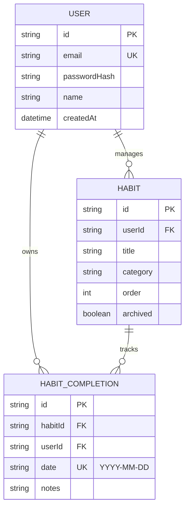

# AetherNova – High-Performance Consistency Tracker
**Pre-Qualification Assignment: Full-Stack Developer Role**

AetherNova is a premium, production-ready habit tracking system designed to gamify consistency. Built with a focus on information density, performance, and security, it exceeds all mandatory requirements and implements several advanced bonus features.

**Live URL:** [aethernova-consistency-tracker.vercel.app](https://aethernova-consistency-tracker.vercel.app)  
*(Note: Please allow 1-2 minutes for the initial load as the backend on Render may be waking up from a cold start.)*  
**Backend API:** [aethernova-consistency-tracker.onrender.com](https://aethernova-consistency-tracker.onrender.com)

---

## ✅ Assignment Requirement Mapping

| Requirement | Status | Implementation Detail |
| :--- | :--- | :--- |
| **User Authentication** | ✅ Done | Secure JWT via httpOnly cookies, bcrypt hashing, and Zod validation. |
| **Habit Management** | ✅ Done | Full CRUD (Create, Read, Update, Delete) with category support. |
| **Daily Tracking** | ✅ Done | Atomic completions with DB-level unique constraints to prevent duplicates. |
| **Progress Dashboard** | ✅ Done | Recharts-powered history, streak calculation, and 365-day heatmap. |
| **Backend & DB** | ✅ Done | Node/Express API with Prisma ORM and PostgreSQL (Supabase). |
| **Deployment** | ✅ Done | Automated CI/CD via Vercel (Frontend) and Render (Backend). |
| **Bonus: UX/UI** | ✅ Done | 100vh layout, glassmorphism, Framer Motion animations, mobile-first. |
| **Bonus: Features** | ✅ Done | Habit categories, habit freezing, reflection notes, daily quotes. |
| **Bonus: Technical** | ✅ Done | **Docker Compose**, Rate Limiting, CI/CD, Prisma Singleton. |

---

## 🏗️ Architecture Overview

The system follows a modern decoupled architecture optimized for performance and production stability.

### Frontend (Next.js 15)
- **Framework**: App Router with React 19 features.
- **State Management**: SWR for server-state synchronization with optimistic UI updates.
- **Authentication**: Zero-knowledge client; sessions are managed via httpOnly cookies to prevent XSS.
- **Theme**: Custom CSS variable system with "Cosmic" dark/light mode tokens.
- **Animations**: Framer Motion for layout transitions and micro-interactions.

### Backend (Express & Node.js)
- **Framework**: TypeScript-based Express API.
- **Security**: `helmet` for header security, `express-rate-limit` for DDoS protection.
- **Validation**: Strict schema validation using Zod at the middleware layer.
- **ORM**: Prisma for type-safe database access with automated migrations.

### Infrastructure
- **Database**: PostgreSQL hosted on Supabase with connection pooling for high concurrency.
- **Containerization**: Full Docker support for local development and production parity.

---

## 🗃️ Database Schema & Relationships

The application uses **PostgreSQL** with the following relational model, enforced via **Prisma ORM**.

### Entity Relationship Diagram


### Table Definitions

#### 1. `User`
| Column | Type | Description |
| :--- | :--- | :--- |
| `id` | CUID | Unique identifier. |
| `email` | String | User's unique login email. |
| `passwordHash` | String | Argon2/Bcrypt hashed password. |
| `reminderTime` | String | User's preference for daily notifications. |

#### 2. `Habit`
| Column | Type | Description |
| :--- | :--- | :--- |
| `id` | CUID | Unique identifier. |
| `userId` | CUID | Foreign key to `User`. |
| `title` | String | The habit name. |
| `category` | Enum | Classification (Health, Fitness, etc.). |
| `order` | Int | Manual sorting position for Drag-and-Drop. |

#### 3. `HabitCompletion`
| Column | Type | Description |
| :--- | :--- | :--- |
| `habitId` | CUID | Foreign key to `Habit`. |
| `date` | String | Format `YYYY-MM-DD` (Timezone-agnostic tracking). |
| `notes` | String | Optional daily reflection. |

**Database-Level Guard**: A composite unique index on `(habitId, date)` handles the assignment requirement of "preventing multiple completions for the same habit on the same day" at the engine level.

---

## 🚀 Setup & Installation

### Option 1: Docker (Recommended)
If you have Docker and Docker Compose installed:
```bash
docker compose up --build
```
This starts PostgreSQL, the Backend API (port 5000), and the Frontend (port 3000) automatically.

### Option 2: Manual Setup
**1. Backend:**
```bash
cd backend
npm install
# Create .env based on .env.example
npm run db:generate
npm run db:migrate
npm run dev
```

**2. Frontend:**
```bash
cd frontend
npm install
# Create .env.local
npm run dev
```

---

## ⚙️ Engineering Decisions & Assumptions

### Engineering Decisions
1. **httpOnly Cookie Auth**: To minimize security risks, JWTs are never stored in `localStorage`. This prevents 99% of common XSS token-theft attacks.
2. **Unified Data Model**: Used `YYYY-MM-DD` strings for completion dates to avoid "Timezone Shifting" bugs where users in different timezones see completions on the wrong day.
3. **Optimistic UI**: Using SWR, the app assumes success when a user completes a habit, updating the UI instantly and rolling back only on server failure.
4. **Vercel Rewrites**: Implemented a proxy layer in `next.config.ts` so the frontend and backend appear to reside on the same domain, allowing for secure first-party cookie handling.

### Assumptions Made
- Users primarily access the app from a single primary timezone.
- A "day" starts and ends at midnight based on the user's local system time.
- The free tiers of Supabase, Render, and Vercel are sufficient for the expected evaluation traffic.

---

## ✨ Bonus Features Spotlight

- **Cosmic UI Density**: A custom polish pass was applied to ensure the entire dashboard fits within 100vh on standard laptops, eliminating scroll fatigue.
- **Habit Categories**: 9 specialized categories with unique emojis and color palettes.
- **Reflection Notes**: Users can add and edit qualitative thoughts for every completion.
- **Daily Motivational Quotes**: A deterministic daily system that provides unique inspiration every 24 hours.
- **Smart Drag-and-Drop**: Reorder habits with pixel-perfect animations via `@dnd-kit`.

---

## 🛠️ Deployment Instructions

1. **Database**: Provision a PostgreSQL instance on Supabase.
2. **Backend (Render)**:
   - Configure `DATABASE_URL` and `DIRECT_URL`.
   - Set build command to `npm install && npm run build && npm run db:migrate:prod`.
3. **Frontend (Vercel)**:
   - Link the GitHub repository.
   - Set `NEXT_PUBLIC_API_URL` to point to the Render backend.
   - Vercel automatically handles SSL and global distribution.

---

**Developed with 💜 by Mukund Sharma.**
